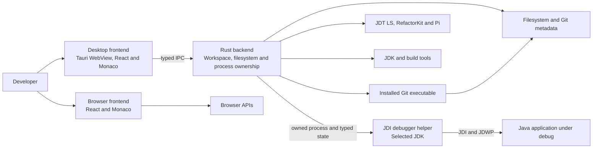

# C4 Containers

Architecture description: [ARC42 chapter 5](../../ARC42.md#section-5-building-block-view).

```mermaid
flowchart LR
    Developer[Developer] --> Web[Browser frontend\nReact and Monaco]
    Developer --> Desktop[Desktop frontend\nTauri WebView, React and Monaco]
    Desktop -->|typed IPC| Rust[Rust backend\nWorkspace, filesystem and process ownership]
    Web --> Browser[Browser APIs]
    Rust --> FS[Filesystem and Git metadata]
    Rust --> Git[Installed Git executable]
    Git --> FS
    Rust --> Providers[JDT LS, RefactorKit and Pi]
    Rust --> Java[JDK and build tools]
    Rust -->|owned process and typed state| Debugger[JDI debugger helper\nSelected JDK]
    Debugger -->|JDI and JDWP| Debuggee[Java application under debug]
```

Detailed model: [workspace.dsl](workspace.dsl), view `IdeContainers`.
