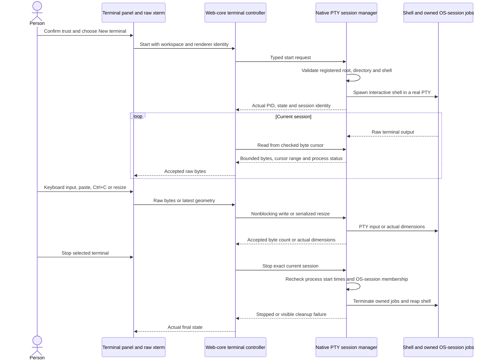

# Workspace Terminal Runtime

Implemented Linux interactions. Behavior, bounds and limitations: [ARC42 section 6.7](../../ARC42.md#67-interactive-workspace-terminals).

```mermaid
sequenceDiagram
    actor Person
    participant UI as Terminal panel and raw xterm
    participant Controller as Web-core terminal controller
    participant Native as Native PTY session manager
    participant Shell as Shell and owned OS-session jobs
    Person->>UI: Confirm trust and choose New terminal
    UI->>Controller: Start with workspace and renderer identity
    Controller->>Native: Typed start request
    Native->>Native: Validate registered root, directory and shell
    Native->>Shell: Spawn interactive shell in a real PTY
    Native-->>Controller: Actual PID, state and session identity
    loop Current session
        Shell-->>Native: Raw terminal output
        Controller->>Native: Read from checked byte cursor
        Native-->>Controller: Bounded bytes, cursor range and process status
        Controller-->>UI: Accepted raw bytes
    end
    Person->>UI: Keyboard input, paste, Ctrl+C or resize
    UI->>Controller: Raw bytes or latest geometry
    Controller->>Native: Nonblocking write or serialized resize
    Native->>Shell: PTY input or actual dimensions
    Native-->>Controller: Accepted byte count or actual dimensions
    Person->>UI: Stop selected terminal
    Controller->>Native: Stop exact current session
    Native->>Native: Recheck process start times and OS-session membership
    Native->>Shell: Terminate owned jobs and reap shell
    Native-->>Controller: Stopped or visible cleanup failure
    Controller-->>UI: Actual final state
```
